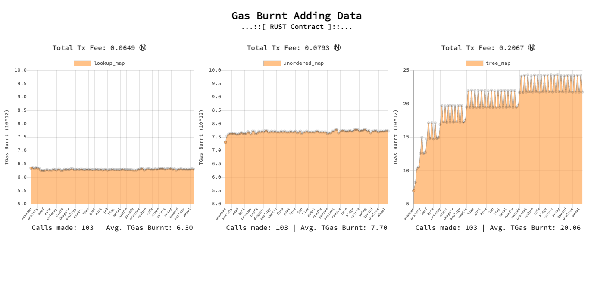

# NEAR Rust Collection Examples using `near-sdk-rs`

This repository serves to demonstrate differences in gas consumption when storing or retrieving data from the NEAR blockchain using [Rust](https://www.rust-lang.org/) collection methods found in [`near-sdk-rs`](https://github.com/near/near-sdk-rs).

After running `setData.js` or `getData.js`, results will be populated in a chart and automatically displayed upon completion.



## Prerequisites

- Current version of [Node.js](https://nodejs.org/). >=v14.0.0
- [NEAR `testnet` account](https://wallet.testnet.near.org/)
- [`near-cli`](https://docs.near.org/docs/development/near-cli#setup) - _(command line interface to interact with the NEAR blockchain)_
- [yarn](https://classic.yarnpkg.com/en/docs/install) - _(dependency management tool)_

## Setup

1. Install dependencies by running:

   ```bash
   yarn
   ```

2. Store your access keys locally

   If you do not already have keys stored locally, run:

   ```bash
   near login
   ```

   You will be redirected to [NEAR `testnet` wallet](https://wallet.testnet.near.org/) to authorize `near cli`. Once permission is granted, you will have a full access key stored as a `.json` file in `~/.near-credentials`. For non macOS / Linux users, this "hidden" folder is located in the root of your HOME directory.

3. Set an environment variable for `NEAR_ACCOUNT`

   Set your account name as environment variable to use in these examples. Create one in your `bash` or `zsh` profile (recommended) or run the following in your terminal. _(replacing `example.testnet` with your account that you have full access keys stored locally)_

   ```bash
   export NEAR_ACCOUNT=example.testnet
   ```

   **Windows users:** Please look into using `set` instead of `export`, surrounding the environment variable in `%` instead of beginning with `$`.

4. Create a subaccount to deploy a smart contract to

   For this example you will deploy a smart contract to a [subaccount](https://docs.near.org/docs/concepts/account#subaccounts). We will do this so we can easily delete and recreate an account to reset _all_ of the data stored in the contract.

   To create this subaccount run:

   ```bash
   yarn create-account
   ```

5. Deploy your smart contract

   A `.wasm` file is already compiled for you and ready to deploy. To do so, simply run:

   ```bash
   yarn deploy
   ```

   You can view the source code of this deployed contract by navigating to `smart-contract/lib.rs`

### Storing Data

Open `setData.js` in your local IDE and select the number of records you would like to add to the three collection examples. You can do so by changing the number passed to `getDataSet()` at the bottom of this file.

To run the script, type the following in your terminal:

```bash
node setData.js
```

The Node script will start to run and console log the `gas_burnt`, `responseTime`, and current key of the data being stored. Once complete, a chart will automatically launch showing you your results. At anytime you can view the chart progress by manually running:

```bash
yarn setCharts
```

### Retrieving Data

Open `getData.js` and make sure the number passed to `getData()` is the same number of values you just added. Once verified, run:

```bash
node getData.js
```

Again, the script will start running returning `gas_burnt`, `responseTime` and the current key of the data retrieved. Once complete, a chart will automatically launch showing you your results. At anytime you can view the chart progress by manually running:

```bash
yarn getCharts
```

### View Example Results

This process can take some time depending on the amount of records you decide to add. If you would like to see what some example results look like right away, run the following to see example `setData()` results:

```bash
yarn exSetCharts
```

For example `getData()` results, run:

```bash
yarn exGetCharts
```

### Clearing Results

Once you run `setData.js` or `getData.js` your results will automatically clear and begin re-writing. If you would like to manually reset the user results data run:

```bash
yarn clear
```

**Note:** that this is just to clear the results from your contract calls, not the data stored in the contract itself. To clear the data in the contract, you can delete & recreate the account then redeploy the contract by running:

```bash
yarn rebuild
```

### Using Your Own data

You can use your own dataset with `setData.js` and `getData.js`. Just pass these functions an array of objects in the same format as `services/data.js` _(`key` and `value` must be strings)_

```js
[
  {
    key: "YOUR_KEY",
    value: "YOUR_VALUE",
  },
];
```

### Advisory

Sometimes, with large data amounts you may run into `BadGateway` or `Transaction has expired`. If this happens try lowering the number of values you are entering or simply try re-running the script. You may need to reset the data already stored by rebuilding the contract which can be performed by running:

```bash
yarn rebuild
```

Please let us know if you continue to run into this issue on [Discord](http://near.chat) or [Telegram](https://t.me/cryptonear) :)

Happy coding! 🚀
